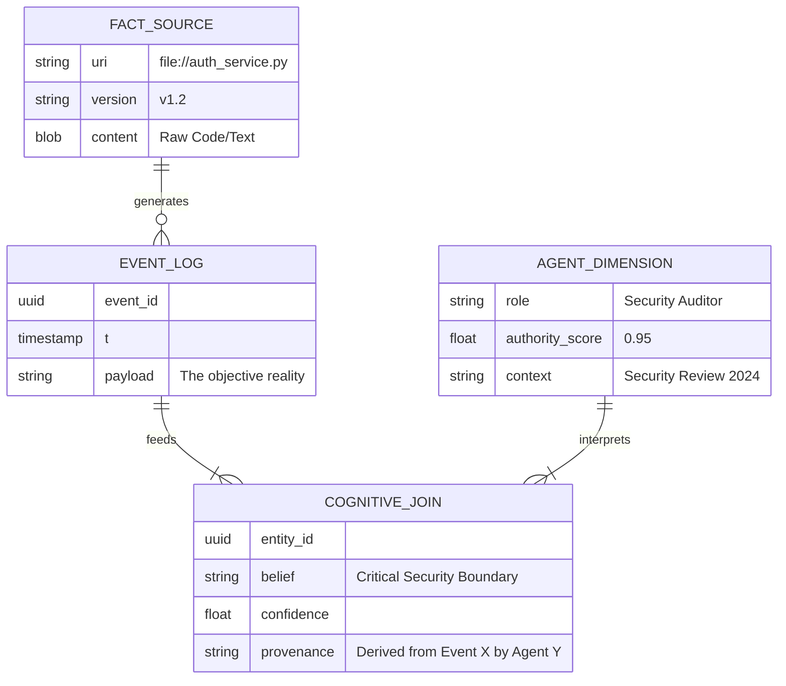

# Cognitive Galaxy Schema: OLAP for Cognition

> "Memory Thread normalizes truth the way data warehouses normalize facts."

## The Core Insight

Most AI memory systems follow a flat pattern: **Flatten → Embed → Forget Source**.
Memory Thread (MT) follows a structural pattern: **Normalize → Relate → Reason**.

This structure maps directly to **Data Warehouse Galaxy Schemas**, but applied to *cognition* instead of *analytics*.

## The Schema Mapping

| Data Warehouse Concept | Memory Thread Implementation | Description |
|------------------------|------------------------------|-------------|
| **Fact Table** | **Immutable Events** | The raw, undisputed reality. Code files, logs, sensor dumps. Append-only, versioned, no opinion. |
| **Dimension Table** | **Derived Beliefs** | Interpretations, summaries, and meanings derived from facts. Subject to decay, perspective, and contradiction. |
| **Surrogate Key** | **Entity ID** | The stable identifier linking diverse observations to a single conceptual entity. |
| **Slowly Changing Dimension (SCD)** | **Memory Decay / Freshness** | How beliefs evolve over time (Type 2 SCD). |
| **Lineage** | **Provenance Envelope** | The `derived_from` metadata tracking exactly which Fact generated which Belief. |
| **Rollback** | **Event Replay** | Deterministic reconstruction of state at any point in time. |

## Structural Visualization

## The "Galaxy" Concept

In a Galaxy Schema, multiple Fact Tables share Dimensions. In MT, **Multiple Belief Systems (Dimensions)** coexist over the same **Facts**.

### Example: The "Auth Service" Fact

**FACT:** `src/auth_service.py` (Content hash: `abc1234`)

1.  **Dimension A (Coder Agent):**
    *   *Belief:* "Handles JWT token parsing."
    *   *Confidence:* 0.9
    *   *Action:* Refactor for performance.

2.  **Dimension B (Security Agent):**
    *   *Belief:* "Legacy OAuth implementation; potential vulnerability."
    *   *Confidence:* 0.7
    *   *Action:* Flag for audit.

3.  **Dimension C (Architect Agent):**
    *   *Belief:* "Core infrastructure component."
    *   *Authority:* High
    *   *Action:* Protect from deletion.

**Result:** No conflict. Just different "Cognitive Joins" on the same truth.

## OLAP Operations for Cognition

Because we have this structure, we can perform OLAP-style operations on memory:

*   **SLICE (by Source):** "Show me all beliefs derived from `auth_service.py`."
*   **DICE (by Authority):** "Show me beliefs about `auth_service.py` held by agents with `Authority > 0.8`."
*   **DRILL DOWN:** "Show me the raw event log that led to this belief."
*   **ROLL UP:** "Summarize the system architecture based on all high-confidence beliefs."

## Terminology

*   **Cognitive Galaxy Schema:** The overarching architectural pattern.
*   **Truth-Normalized Memory:** The data storage strategy (store facts once, reference many).
*   **Epistemic Star:** A specific cluster of beliefs surrounding a single entity.
