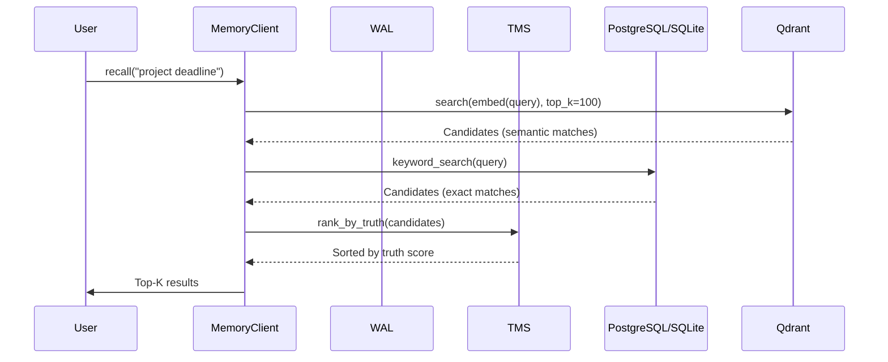

# Functional Workflows: A Technical Deep Dive

## 1. The Autonomous Chat Workflow (Primary Interaction)

This is the core workflow. When a user types `mt` and sends a message, everything happens automatically.

**Algorithm:**

1.  **Auto-Remember User Input:**
    - `client.remember(message, source="user")`
    - WAL pre-write → `fsync()` guarantee
    - Create TruthVector $(C=0.8, A=1.0, F=1.0, R=0)$
    - Entity extraction via NER
    - Relation inference between entities
    - Persist to PostgreSQL/SQLite → Index in Qdrant
    - WAL commit
2.  **Contradiction Check:**
    - `client.check_contradiction(message)`
    - Compares against all stored memories
    - Flags semantic conflicts (e.g., "I'm vegan" vs "I ordered steak")
3.  **Context Building:**
    - Aggregates ALL stored memories into context
    - Filters by namespace access (RBAC)
    - Limits to top 15 memories by truth score
4.  **LLM Response Generation:**
    - Constructs prompt: system_prompt + context + contradiction_notes + user_message
    - Provider chain: Groq → OpenRouter → local SmolLM (automatic fallback)
5.  **Auto-Remember Response:**
    - `client.remember(response, source="agent", authority=0.5)`
    - Agent responses stored with lower authority than user messages

## 2. The Memory Write Workflow (Crash-Safe Path)

Every memory write follows a strict WAL protocol:

**Algorithm:**

1.  **WAL Pre-Write:**
    - Serialize operation to WAL file
    - `fsync()` to ensure durability
    - Record: `{sequence, operation, payload, status="pending"}`
2.  **Truth Scoring:**
    - `TMSService.create_event(delta=content)`
    - Assign UUID, Timestamp
    - Init TruthVector based on source authority
3.  **State Derivation:**
    - $S_{new} = \text{Apply}(S_{old}, E)$
    - Arithmetic: `tree_count += 5`
    - Replacement: `location = "Paris"`
4.  **Entity Extraction:**
    - NER: Find entities (People, Places, Dates)
    - Embedding: Generate vector via `all-MiniLM-L6-v2` (384 dimensions)
5.  **Persistence (Triple Write):**
    - PostgreSQL: `INSERT INTO events ...` + `UPSERT entity_state`
    - Qdrant: `upsert(points=[...])`
    - If Postgres unavailable: SQLite fallback
    - If Qdrant unavailable: Skip (keyword search still works)
6.  **WAL Commit:**
    - Mark entry as committed: `{status="committed"}`
    - On crash: Uncommitted entries replayed on next startup

## 3. The Retrieval Workflow (Hybrid Search)

Retrieval is not a simple database lookup; it is a reconstruction of knowledge.

**Algorithm:**

1.  **Query Analysis:** Input query $Q$.
2.  **Vector Search (Recall):**
    - Embed $Q \rightarrow V_q$.
    - Query Qdrant: `search(collection="memories", vector=V_q, limit=100)`.
    - Result set $R_{vec} = \{ (doc_i, score_i) \}$.
    - Fallback: PostgreSQL `websearch_to_tsquery(Q)` if Qdrant unavailable.
3.  **Graph Filtering (Precision):**
    - Extract entities $E_q$ from $Q$.
    - Query Graph: Find neighbors $N(E_q)$.
    - Filter $R_{vec}$: Keep $doc_i$ only if $doc_i$ relates to $N(E_q)$.
4.  **RBAC Filtering:**
    - Remove results from namespaces above user's clearance grade.
    - Replace with `[REDACTED]` placeholders.
5.  **Truth Ranking (Trust):**
    - For each candidate $d \in R_{filtered}$:
    - Calculate $S = 0.4 C_d + 0.35 A_d + 0.25 F_d + 0.1 \ln(1 + R_d)$.
    - Sort by $S$ descending.
6.  **Response:** Return top $k$ results with provenance metadata.

## 4. The Replay Workflow (Time Travel)

The "Crown Jewel" for debugging and correctness.

**Algorithm:**

1.  **Initialize:** Create empty state $S_{sim} = \emptyset$.
2.  **Fetch Log:** `SELECT * FROM events WHERE object_id=X ORDER BY timestamp ASC`.
    - Result stream $E = [e_0, e_1, \dots, e_n]$.
3.  **Simulation Loop:**
    - For $i = 0$ to $n$:
    - $S_{sim} \leftarrow \text{StateDerivationService.apply}(S_{sim}, e_i)$.
4.  **Verification:**
    - Fetch actual current state $S_{db}$ from `entity_state`.
    - Compute Diff $D = |S_{sim} - S_{db}|$.
    - If $D > \epsilon$ (where $\epsilon = 1e-6$), raise `StateCorruptionError`.

## 5. The Maintenance Workflow (Sleep Cycle)

Runs periodically to optimize memory health.

**Algorithm:**

1.  **Decay Pass:**
    - For each memory $M$:
    - Update $M.freshness = M.freshness \cdot e^{-\lambda \Delta t}$.
    - Configurable $\lambda$ per memory type.
2.  **Pruning Pass:**
    - If $S(M) < \text{Threshold}_{prune}$ (default 0.3):
    - Remove from active storage.
3.  **Consolidation Pass:**
    - Identify cluster $C = \{e_1, \dots, e_k\}$ of repetitive events.
    - Generate summary event with combined data.
    - Mark source events as `consolidated_into: summary_id`.
    - Keep source events in event log (never delete).
