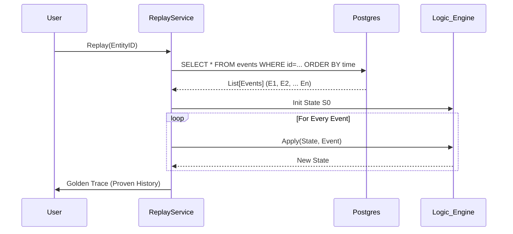

# Memory Thread: End-to-End Workflow Analysis

This document provides a microscopic trace of data flow within the system, detailing every component's role, processing logic, and technological interactions from ingestion to retrieval.

---

## 1. The Chat Workflow (Autonomous Path)

**Objective:** Accept a user message, auto-remember it, detect contradictions, build context, generate a response, and store the response — all transparently.

### Step 1.1: User Input

- **Component:** `cli.py` → `MemoryClient.chat()`
- **Input:** User message string (e.g., "My project deadline is March 15th")
- **Action:**
  1.  CLI passes message to `client.chat(user_message)`.
  2.  Chat orchestrates all downstream operations.

### Step 1.2: Auto-Remember (Write Path)

- **Component:** `MemoryClient.remember()`
- **Action:**
  1.  **WAL Pre-Write:** Serialize operation → `fsync()` to WAL file.
  2.  **Entity ID Generation:** Deterministic UUID based on `(namespace, content_hash)`.
  3.  **Truth Vector Init:** $(C=0.8, A=1.0, F=1.0, R=0)$ for user messages.
  4.  **Event Creation:** `TMSService.create_event(actor=USER, action=ADD, delta={content, type})`.
  5.  **State Derivation:** $S_{new} = f(S_{old}, Event)$. Apply delta to entity state.
  6.  **Entity Extraction:** NER extracts named entities (people, places, dates).
  7.  **Relation Inference:** Builds structured relationships between entities.
  8.  **Persistence:**
      - PostgreSQL: `INSERT INTO events` + `UPSERT entity_state`.
      - Qdrant: Embed text → `upsert(points=[...])`.
      - Fallback: SQLite if Postgres unavailable. Skip Qdrant if unavailable.
  9.  **WAL Commit:** Mark entry as committed.

### Step 1.3: Contradiction Detection

- **Component:** `MemoryClient.check_contradiction()`
- **Action:**
  1.  Compare new message against all stored memories.
  2.  If semantic conflict detected (e.g., "I'm vegan" vs stored "ordered steak"):
      - Return `{has_contradiction: true, conflicting_memory: "..."}`.
      - Contradiction note injected into LLM prompt.

### Step 1.4: Context Building

- **Component:** `MemoryClient.chat()` (inline)
- **Action:**
  1.  Iterate all stored entity states: `self._memories.items()`.
  2.  Filter by memory type: `fact`, `relation`, `preference`, `identity`.
  3.  Build context string: "What I know about the user: [memory1, memory2, ...]".
  4.  Limit to top 15 memories.

### Step 1.5: LLM Response Generation

- **Component:** `MemoryClient._generate_local()` or `._generate_cloud()`
- **Action:**
  1.  Construct full prompt: `system_prompt + context + contradiction_notes + user_message`.
  2.  Provider selection:
      - `use_local=True` → SmolLM (local, offline).
      - `use_local=False` → Groq SDK or OpenRouter API.
  3.  Generate response text.

### Step 1.6: Auto-Remember Response

- **Component:** `MemoryClient.remember(response, source="agent")`
- **Action:**
  1.  Same write path as Step 1.2.
  2.  Authority set lower: $(C=0.7, A=0.5, F=1.0, R=0)$.
  3.  Agent responses are stored but trusted less than user input.

---

## 2. The Search Workflow (Retrieval)

**Objective:** Find relevant memories ranked by truth score.

### Step 2.1: Search Strategy

- **Component:** `MemoryClient.recall()`
- **Input:** Query string $Q$.
- **Parallel Execution:**
  1.  **Vector Search:** Embed $Q$ → search Qdrant → semantically similar items.
  2.  **Keyword Search:** PostgreSQL `websearch_to_tsquery(Q)` → exact matches.
  3.  **Hybrid Mode:** Combine both result sets.

### Step 2.2: The Ranking Equation

- **Action:** Merge results and compute Final Score.
- **Formula:**
  $$ Score = 0.4 C + 0.35 A + 0.25 F + 0.1 \ln(1 + R) $$
- **RBAC Filter:** Remove results from namespaces above user's clearance grade.
- **Output:** Top-K sorted results with provenance metadata.

---

## 3. The Replay Workflow (Time Travel)

**Objective:** Verify that current state is mathematically correct.

### Step 3.1: Replay Execution

- **Component:** `ReplayService`

---

## 4. The Maintenance Workflow (Sleep Cycle)

**Objective:** Optimize storage and remove noise.

### Step 4.1: Decay & Pruning

- **Component:** `DecayEngine` / `PrunerService`
- **Trigger:** CLI command (`mt decay`, `mt prune`) or future scheduled job.
- **Action:**
  1.  **Decay:** $F_{new} = F_{old} \cdot e^{-\lambda t}$. Update all freshness values.
  2.  **Prune:** If $Score < 0.3$, remove from active storage.

### Step 4.2: Consolidation

- **Component:** `AssimilatorService`
- **Action:**
  1.  **Pattern Detection:** Find repetitive event sequences on same entity.
  2.  **Consolidation:** Merge into summary event with combined data.
  3.  **Audit:** Source events marked as `consolidated_into: summary_id`, never deleted.

---

## 5. The Galaxy Workflow (Multi-Agent Cognition)

**Objective:** Enable multiple agents to hold different beliefs about the same facts.

### Step 5.1: Fact Ingestion

- **Component:** `MemoryClient.ingest_fact()`
- **Action:** Store immutable fact in Layer 0 (content-addressed, versioned).

### Step 5.2: Belief Derivation

- **Component:** `MemoryClient.derive_belief()`
- **Action:** Agent creates interpretation of fact in Layer 1 with confidence score and provenance.

### Step 5.3: Conflict Detection

- **Component:** `MemoryClient.get_galaxy_conflicts()`
- **Action:** Identify beliefs about the same fact with contradictory interpretations across agents.

### Step 5.4: OLAP Queries

- **Component:** `MemoryClient.query_galaxy()`
- **Operations:**
  - **SLICE:** Filter by source ("beliefs from auth.py")
  - **DICE:** Multi-filter ("beliefs from SecurityBot with authority > 0.8")
  - **DRILL_DOWN:** Get source fact for a belief
  - **ROLL_UP:** Aggregate beliefs into summary
  - **SEARCH:** Semantic search across beliefs
